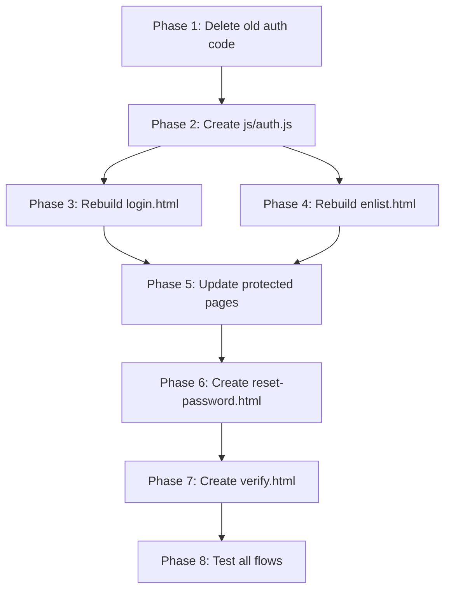

# 🚀 User Management System Rebuild Plan
## Space Science Club — Complete Auth Overhaul

---

## 1. Project Context

| Item | Detail |
|---|---|
| **Project** | Static HTML/CSS/JS website (no framework) |
| **Auth Provider** | Supabase Auth (JS SDK v2 via CDN) |
| **Root Dir** | `/home/abel/Documents/Python/Website/Space-Science` |
| **Main CSS** | `css/style.css` (2135 lines, contains all design tokens) |
| **Supabase Client** | `js/supabaseClient.js` (570 lines, auth + data + utilities) |
| **Env Loader** | `js/env.js` (loads `window.__ENV` from meta tags) |
| **Admin Email** | `admin@nexus.com` (hardcoded in RLS function `is_admin()`) |

---

## 2. Design System Reference

> [!IMPORTANT]
> All new pages MUST use these exact tokens from `css/style.css` `:root`. Do NOT invent new colors or fonts.

### Colors
```
--bg-primary: #050a18          (page background)
--bg-secondary: #0a1128        (card alt background)
--bg-card: rgba(10, 17, 40, 0.7)  (glassmorphic cards)
--bg-glass: rgba(15, 26, 58, 0.4) (glass surfaces)
--accent-blue: #4a9eff         (primary accent, links, focus rings)
--accent-cyan: #06d6a0         (success states, active indicators)
--accent-purple: #7b5ea7       (gradients)
--accent-pink: #c77dff         (errors, warnings)
--text-primary: #ffffff
--text-secondary: rgba(255, 255, 255, 0.7)
--text-muted: rgba(255, 255, 255, 0.45)
--border-glass: rgba(255, 255, 255, 0.08)
--border-glow: rgba(74, 158, 255, 0.3)
--gradient-accent: linear-gradient(135deg, #4a9eff, #7b5ea7)
```

### Fonts
```
--font-display: 'Outfit', sans-serif     (headings, 800/900 weight)
--font-body: 'Inter', sans-serif         (body text, 400/500)
--font-mono: 'Space Grotesk', sans-serif (labels, metadata, eyebrows)
```

### Key Component Patterns
- **Section Eyebrow**: `font-mono`, uppercase, `letter-spacing: 0.25em`, color `--accent-blue`, has `::before` pseudo 40px line
- **Section Title**: Uses `.outline-text` (transparent fill + white stroke) and `.bold-text` (solid white)
- **Form Inputs**: `rgba(255,255,255,0.03)` bg, `--border-glass` border, `--radius-md` (12px), focus: `--accent-blue` border + blue box-shadow
- **Submit Button**: `.btn-submit` class — `--gradient-accent` bg, white text, `--radius-md`, hover: translateY(-2px) + blue shadow
- **Cards**: `--bg-card` bg + `backdrop-filter: blur(10px)` + `--border-glass` border + `--radius-lg` (20px)
- **Loader**: `.loader-overlay` with terminal lines + progress bar (already in `style.css`)
- **Star Canvas**: `<canvas id="star-canvas">` — rendered by `js/script.js`, fixed position behind all content
- **Navbar**: `.navbar.scrolled` class for inner pages (always shows blurred bg)

---

## 3. What to DELETE (Phase 1)

> [!CAUTION]
> Delete ALL of the following auth-related code. Leave non-auth utilities (escapeHTML, showToast, data fetching) intact.

### 3A. Files to DELETE entirely
| File | Reason |
|---|---|
| `js/enlist.js` | Old signup form handler, will be rebuilt |
| `login.html` | Old login page, will be rebuilt from scratch |

### 3B. Code to DELETE from `js/supabaseClient.js`
Remove these functions (lines ~96–150):
- `submitEnlistment()` — old signup logic
- `loginUser()` — old login
- `loginAdmin()` — wrapper around loginUser
- `signOut()` — will be rebuilt in new auth module
- `getCurrentUser()` — will be rebuilt in new auth module

**Keep everything else** in `supabaseClient.js`: `escapeHTML`, `showToast`, all data-fetching functions (`getResearchPapers`, `getBlogPosts`, etc.), XP/gamification, storage, notifications, interactions, missions, leaderboard.

### 3C. Code to DELETE from `enlist.html`
Delete the **entire file contents** — it will be rebuilt from scratch.

### 3D. Code to DELETE from other files (inline auth logic)
| File | What to Remove |
|---|---|
| `index.html` lines 587-610 | The `smartDashboardRedirect()` function |
| `index.html` line 58 | The `onclick="smartDashboardRedirect()"` inline handler |
| `recruit-dashboard.html` lines 41-82 | The inline `<script>` block with `waitForSupabase`, `initDashboard`, `handleSignOut` |
| `admin.html` lines 430-469 | The login overlay script (loginBtn listener, admin email check) |
| `profile.html` line 100 | The hardcoded `<a href="login.html">` link |

---

## 4. New Architecture (Phase 2)

### 4A. Create `js/auth.js` — Centralized Auth Module

> [!IMPORTANT]
> This is the single source of truth for ALL auth operations across the entire site. Every page imports this file.

```
File: js/auth.js
Purpose: Unified auth API — login, signup, logout, session checks, role routing, password reset
Dependencies: js/env.js, js/supabaseClient.js (must be loaded first)
```

**Functions to implement:**

| Function | Signature | Purpose |
|---|---|---|
| `waitForSupabase()` | `() → Promise<void>` | Polls until `window.supabaseClient` exists (50ms interval) |
| `getCurrentUser()` | `() → Promise<User\|null>` | Calls `supabaseClient.auth.getUser()`, returns user or null |
| `getUserRole(user)` | `(user) → 'admin'\|'recruit'` | Returns `'admin'` if `user.email === 'admin@nexus.com'`, else `'recruit'` |
| `signUp(email, password, metadata)` | `(string, string, {callsign, identifier}) → Promise<User>` | Calls `supabaseClient.auth.signUp()` with user_metadata |
| `signIn(email, password)` | `(string, string) → Promise<User>` | Calls `supabaseClient.auth.signInWithPassword()` |
| `signOut()` | `() → Promise<void>` | Calls `supabaseClient.auth.signOut()`, redirects to `index.html` |
| `resetPassword(email)` | `(string) → Promise<void>` | Calls `supabaseClient.auth.resetPasswordForEmail()` |
| `createEnlistmentRecord(user, formData)` | `(User, FormData) → Promise<void>` | Inserts into `enlistments` table after signup |
| `redirectByRole(user)` | `(User) → void` | Sends admin to `admin.html`, recruits to `recruit-dashboard.html` |
| `requireAuth(allowedRoles?)` | `(string[]?) → Promise<User>` | Guard function — redirects to login if not authed or wrong role |
| `requireGuest()` | `() → Promise<void>` | Guard for login/signup pages — redirects away if already logged in |

**Key implementation details:**
- `waitForSupabase()` must have a timeout (5 seconds) that shows an error if Supabase never loads
- `signUp` should NOT auto-login — show a "check your email" message instead (Supabase sends confirmation email by default)
- `requireAuth()` should be called at the TOP of every protected page's init script
- `requireGuest()` should be called at the TOP of login.html and enlist.html init scripts
- All functions must use `try/catch` and return meaningful error messages

### 4B. Script Load Order (for every page)

```html
<script src="https://cdn.jsdelivr.net/npm/@supabase/supabase-js@2"></script>
<script src="js/env.js"></script>
<script src="js/supabaseClient.js"></script>
<script src="js/auth.js"></script>
```

---

## 5. Rebuild `login.html` (Phase 3)

### Design Spec

The login page must match the site's deep-space theme. It should NOT be the current minimal dark box on a black background. It must feel like stepping into a command center.

**Layout:**
- Full-viewport page with `<canvas id="star-canvas">` background
- Centered glassmorphic card (max-width: 480px)
- Navbar at top (`.navbar.scrolled`) with links back to site
- Footer at bottom (same as other pages)

**Card Contents (top to bottom):**
1. Club logo image (`assets/images/Gemini_Generated_Image_6vozdj6vozdj6voz.png`) — 80px circle
2. Section eyebrow: `"IDENTITY VERIFICATION"` (using `.section-eyebrow` pattern)
3. Title: `"Access"` (outline-text) + `" Mission Control"` (bold-text) — using `.section-title` pattern
4. Subtitle: `"Enter your credentials to access the command dashboard."`
5. Error message div (hidden by default) — styled like existing error messages: `rgba(255,125,255,0.1)` bg, `--accent-pink` border/text, `--font-mono`
6. Success message div (hidden by default) — styled like existing success: `rgba(6,214,160,0.1)` bg, `--accent-cyan` border/text
7. **Email field**: label `"COMM-LINK"`, placeholder `"transmission@relay.net"`, using `.terminal-label` + standard `.form-group input`
8. **Password field**: label `"ACCESS KEY"`, placeholder `"••••••••"`, with show/hide toggle icon
9. **"Forgot Access Key?"** link — small text, `--accent-blue`, triggers password reset flow
10. **Submit button**: text `"ESTABLISH UPLINK 🔒"`, class `.btn-submit`, styled with `--accent-cyan` bg + black text + `--font-mono` (matching enlist page pattern)
11. **Signup link**: `"New recruit? Enlist Here →"` linking to `enlist.html`
12. **Divider** with text `"OR"` in the middle
13. **Magic Link button** (optional but recommended): `"Send Magic Link 📡"` — uses `supabaseClient.auth.signInWithOtp({email})`

**Behavior:**
- On page load: call `requireGuest()` — if user already logged in, redirect to dashboard
- On submit: call `signIn(email, password)`, show loading state on button, then call `redirectByRole(user)`
- On error: show error message div with `escapeHTML(err.message)`
- Forgot password: show inline form that takes email, calls `resetPassword()`, shows success toast
- Use the site's loader overlay (`.loader-overlay`) during initial auth check

### CSS

All styles should use existing design tokens from `css/style.css`. Add page-specific styles in a `<style>` block in the `<head>` (matching the pattern used in `enlist.html` and `profile.html`). Key additions:

```css
.auth-container { /* centered card wrapper */ }
.auth-card { /* glassmorphic card using --bg-card, --border-glass, backdrop-filter */ }
.auth-logo { /* circular logo container */ }
.auth-divider { /* horizontal line with "OR" text */ }
.password-toggle { /* show/hide eye icon inside password field */ }
```

---

## 6. Rebuild `enlist.html` (Phase 4)

### Design Spec

Keep the current two-column layout concept (perks on left, form on right) but rebuild the HTML and JS from scratch.

**Layout — Same structure as current but rebuilt cleanly:**
- Loader overlay
- Star canvas
- Navbar (`.navbar.scrolled`)
- Hero header with eyebrow + title + subtitle
- Two-column split: perks panel (left) + registration form (right)
- Footer

**Left Column — Member Benefits (keep current content):**
- Keep all 5 perk badges (Astro-Alerts, Blog, Academic Publishing, Membership Status, Exclusive Resources)
- Keep the clearance warning note
- Use the same `.perk-badge`, `.perk-icon`, `.perk-content` pattern

**Right Column — Registration Form:**
1. Success message div (hidden): `"✓ UPLINK SUCCESSFUL. Check your comm-link for verification."`
2. Error message div (hidden)
3. **Callsign** (first name): label `"CALLSIGN"`, placeholder `"e.g. Apollo"`
4. **Identifier** (last name): label `"IDENTIFIER"`, placeholder `"e.g. 11"`
5. **Comm-Link** (email): label `"COMM-LINK"`, placeholder `"transmission@relay.net"`
6. **Access Key** (password): label `"ACCESS KEY (6+ CHARACTERS)"`, with show/hide toggle, minlength=6
7. **Confirm Access Key**: label `"CONFIRM ACCESS KEY"`, must match password field
8. **Division** select: same 4 options as current
9. **Background Query** textarea: `"Why do you wish to join the collective?"`
10. **Terms checkbox**: `"I agree to the Space Science Club code of conduct"`
11. **Submit button**: `"SUBMIT APPLICATION 🔓"`, cyan bg, black text, mono font

**Behavior:**
- On page load: call `requireGuest()`
- Client-side validation: passwords match, min length 6, all required fields, terms checked
- On submit:
  1. Call `signUp(email, password, {callsign, identifier})`
  2. Call `createEnlistmentRecord(user, formData)` to insert into `enlistments` table
  3. Do NOT auto-redirect — show success message: "Account created! Check your email to verify before logging in."
  4. Optionally show a "Go to Login →" link after success
- On error: show error div with escaped message
- Password strength indicator (optional enhancement): visual bar under password field

---

## 7. Update Protected Pages (Phase 5)

### 7A. `recruit-dashboard.html`
- Add `<script src="js/auth.js"></script>` to head
- Replace the entire inline `<script>` block with:
  ```js
  async function initDashboard() {
    const user = await requireAuth(['recruit', 'admin']);
    document.body.style.display = 'block';
    // ... existing dashboard loading logic using getRecruitData(user.id)
  }
  initDashboard();
  ```
- Replace `handleSignOut()` → call `signOut()` from auth.js

### 7B. `admin.html`
- Add `<script src="js/auth.js"></script>` to head
- Replace the login overlay logic (lines 430-469) with:
  ```js
  async function initAdmin() {
    const user = await requireAuth(['admin']);
    document.getElementById('loginOverlay').style.display = 'none';
    currentUser = user;
    init();
  }
  initAdmin();
  ```
- Remove the loginOverlay HTML entirely (the admin page should just redirect to login.html if not authenticated, not show its own login form)
- Replace `handleAdminSignOut()` → call `signOut()` from auth.js

### 7C. `index.html`
- Add `<script src="js/auth.js"></script>` to head
- Replace `smartDashboardRedirect()` with:
  ```js
  async function smartDashboardRedirect() {
    await waitForSupabase();
    const user = await getCurrentUser();
    if (user) {
      redirectByRole(user);
    } else {
      window.location.href = 'login.html';
    }
  }
  ```

### 7D. `profile.html`
- Add `<script src="js/auth.js"></script>` to head
- Update the Dashboard nav link to use `smartDashboardRedirect()` instead of hardcoded `login.html`

---

## 8. Password Reset Flow (Phase 6)

### New file: `reset-password.html`

**Purpose:** Landing page for password reset email links (Supabase redirects here with a token).

**Design:** Same glassmorphic centered card as login page.

**Contents:**
1. Logo + title "Reset Access Key"
2. New password field + confirm field
3. Submit button: "UPDATE ACCESS KEY 🔑"
4. On submit: call `supabaseClient.auth.updateUser({ password: newPassword })`
5. On success: show toast + redirect to login

**Supabase config needed:** Set the "Redirect URL" for password reset emails in Supabase Dashboard → Authentication → URL Configuration to point to `https://yourdomain.com/reset-password.html`

---

## 9. Email Verification Handling (Phase 7)

### New file: `verify.html` (optional but recommended)

**Purpose:** Confirmation page after email verification link is clicked.

**Design:** Simple centered card with success message.

**Contents:**
1. Logo + "Email Verified ✓"
2. "Your comm-link has been verified. You are now cleared for mission access."
3. "Proceed to Login →" button

**Supabase config:** Set the "Redirect URL" for email confirmation in Supabase Dashboard to `https://yourdomain.com/verify.html`

---

## 10. Database Considerations

### `enlistments` table schema (verify these columns exist):
```sql
id          UUID PRIMARY KEY DEFAULT gen_random_uuid()
user_id     UUID REFERENCES auth.users(id)
callsign    TEXT NOT NULL
identifier  TEXT
commlink    TEXT NOT NULL
division    TEXT
background  TEXT
status      TEXT DEFAULT 'pending'
xp          INTEGER DEFAULT 0
level       INTEGER DEFAULT 1
avatar_url  TEXT
created_at  TIMESTAMPTZ DEFAULT now()
```

### RLS policies (already in `supabase_rls_setup.sql`)
The existing RLS policies are fine. The key ones for auth:
- `enlistments_manage_own`: Users can INSERT/UPDATE their own record
- `enlistments_select_public`: Anyone can read (for leaderboard/profiles)
- `enlistments_admin_all`: Admin can manage everything

> [!NOTE]
> No database schema changes needed. The existing `enlistments` table and RLS policies support the new auth flow.

---

## 11. Execution Order

> [!IMPORTANT]
> Follow this exact order. Each phase depends on the previous one.



### Phase 8: Testing Checklist

| # | Test Case | Expected Result |
|---|---|---|
| 1 | Visit login.html while logged out | Shows login form |
| 2 | Visit login.html while logged in | Redirects to dashboard |
| 3 | Visit enlist.html while logged out | Shows signup form |
| 4 | Visit enlist.html while logged in | Redirects to dashboard |
| 5 | Submit signup with valid data | Shows "check email" message, inserts enlistment record |
| 6 | Submit signup with existing email | Shows error "User already registered" |
| 7 | Submit signup with mismatched passwords | Shows client-side error |
| 8 | Login with valid recruit credentials | Redirects to recruit-dashboard.html |
| 9 | Login with admin credentials | Redirects to admin.html |
| 10 | Login with wrong password | Shows error message |
| 11 | Click "Forgot Access Key" | Shows email input, sends reset email |
| 12 | Visit recruit-dashboard.html without auth | Redirects to login.html |
| 13 | Visit admin.html without auth | Redirects to login.html |
| 14 | Visit admin.html as non-admin | Redirects to recruit-dashboard.html |
| 15 | Click sign out on any protected page | Returns to index.html |
| 16 | "Access Dashboard" link on index.html | Logged in → dashboard, logged out → login |
| 17 | Star canvas renders on login + enlist | Animated starfield visible behind forms |
| 18 | All pages responsive at 768px | Forms stack vertically, nav collapses |

---

## 12. File Summary

| Action | File | Description |
|---|---|---|
| **DELETE** | `js/enlist.js` | Old signup handler |
| **DELETE** | `login.html` | Old login page |
| **CREATE** | `js/auth.js` | Centralized auth module |
| **CREATE** | `login.html` | New themed login page |
| **CREATE** | `enlist.html` | New themed signup page (full rewrite) |
| **CREATE** | `reset-password.html` | Password reset landing page |
| **CREATE** | `verify.html` | Email verification confirmation |
| **EDIT** | `js/supabaseClient.js` | Remove old auth functions (lines 96-150) |
| **EDIT** | `index.html` | Update dashboard redirect, add auth.js |
| **EDIT** | `recruit-dashboard.html` | Use auth.js guards, remove inline auth |
| **EDIT** | `admin.html` | Use auth.js guards, remove login overlay |
| **EDIT** | `profile.html` | Add auth.js, update dashboard link |
